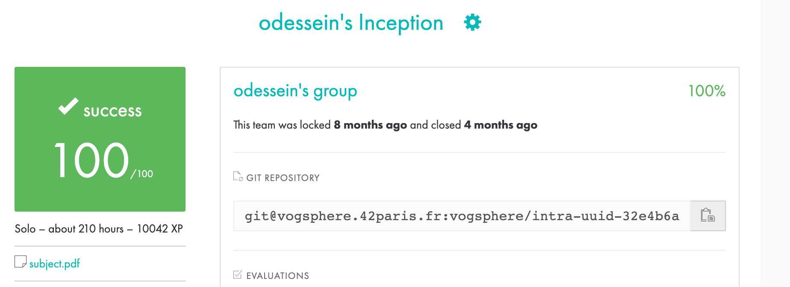

# Inception

The goal was to deploy a WordPress Website from 3 containe.
One for the Database, MariaDb.
One for the Server, Nginx.
And one for wordpress itself.

So i wrote my own docker file setting up all 3 debian container from scratch.

